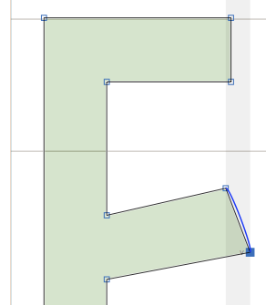
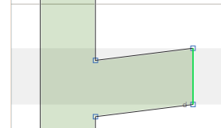
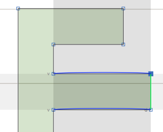
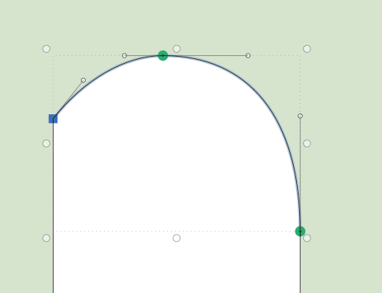
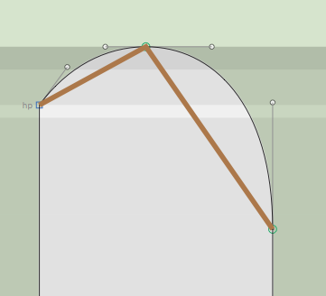
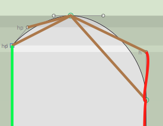
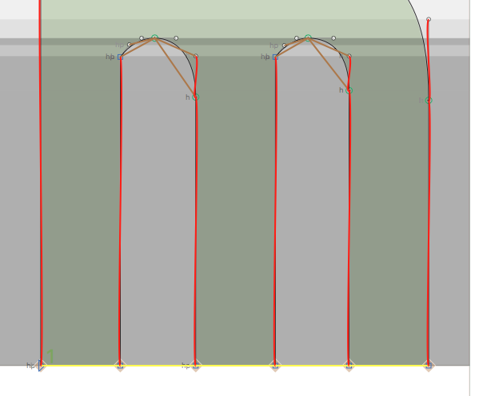
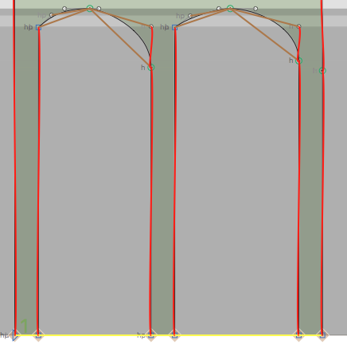

# Springs

Tie your nodes together with flexible springs!

## How to install

Download my [plugins repository][repo] or clone it with Git:

    git clone https://github.com/simoncozens/GlyphsPlugins.git

Double click the `Springs.glyphsTool` or move it into the Glyphs plugin folder. Now reload Glyphs.

## How to use

Springs is a plugin which allows you to define relationships between nodes, and ensure that when nodes are moved, stretched or transformed, those relationships are maintained. An obvious relationship is a stem: when you move one node in a stem, you generally want the stem’s thickness to be preserved.

Think about the letter E for example. As you move one node in the E’s crossbar, you want the node on the other side to move too. This is a vertical stem, so we want the vertical distance between the two nodes to be preserved. We activate the Springs tool, select the two nodes at the end of the crossbar, right click, and choose "Add vertical constraint". A blue line appears connecting the two nodes, and there’s a handle labelled "v" so we know this is a vertical constraint.

Now, as we move the bottom node, the top node moves too:

Very nice. We’ve kept the vertical distance the same, but as we moved our node horizontally, the node on the other side stayed at its previous X position. And maybe you want that for some things, but it’s not what we want for our E. There are two things we could do here. We could select the same two nodes and add another contraint - this time, a horizontal one. (If we do that we get a red line as well as the blue line.) But what we’re going to do instead is delete the vertical constraint by clicking on its handle and making a diagonal constraint as well. This constrains both X and Y distances between two nodes.

Now we find that the nodes move in parallel, maintaining the stem:

But what about the other nodes in our E? We want the arm to remain straight, which means that when we move the crossbar nodes around, we want the two nodes connecting the crossbar to the main stem to move in sync with them. Let’s add two vertical constraints keeping the Y coordinate of the end of the crossbar the same as the nodes on the vertical: one constraint fixing the coordinate of the top two nodes, one fixing the bottom two nodes. As we move one of the crossbar nodes around, everything else follows to keep the crossbar both straight *and* at a consistent stem thickness:

Well, so what? Surely we could just select four nodes at a time and drag them all around instead of just dragging one node, right? Well, yes, but Springs has a few more tricks up its sleeve. First, we can say that *three* nodes should stay in a fixed proportion. Take a look at the arch of this lower-case m:

We want to keep the middle node just under half-way between the outer nodes. We select the three nodes, and then add a horizontal proportion constraint:

We’ll also add a few more constraints, keeping the stems vertical and keeping the right-hand off-curve handle straight, but also making the left-hand off-curve handle move in proportion to the rest of the curve:

Now as we move any of the nodes of our arch around, the whole thing stays arch-shaped.

One final trick. You can also say fix the proportion of two distances. Rather than fixing the stem width of each of our m’s legs, we could say that the stem width of each leg must always be equal to the other legs. To do this, we select four points - the left and right of the right and middle legs - and add a yellow "horizontal proportion constraint". Then we select the left and right nodes of the left and middle legs and do it add another yellow constraint. Our m ends up with quite a lot of constraints:

Now we grab two nodes in one of the legs, and change the stem width, and BOOM:

Stem widths have changed, but proportions have been kept in place. And that’s a good reminder, too - Springs doesn’t just maintain proportions as you drag around points with the mouse, but when you nudge with the keyboard or transform your glyph using the transformations palette and (to a certain degree) with filters. As long as the Springs tool is selected, it will attempt to maintain the constraints for you.

## License

Springs is distributed *free of charge* under the terms of the MIT license (see `LICENSE` file), but if it is useful to you, please multiply how much time you expect it to save you by your hourly rate, and then make what you consider to be a fair donation to me via Paypal.

## Contact

Simon Cozens, `simon@simon-cozens.org`. Please report bugs via the [bug tracker][tracker]

  [repo]: https://github.com/simoncozens/GlyphsPlugins/archive/master.zip
  [tracker]: https://github.com/simoncozens/GlyphsPlugins/issues
